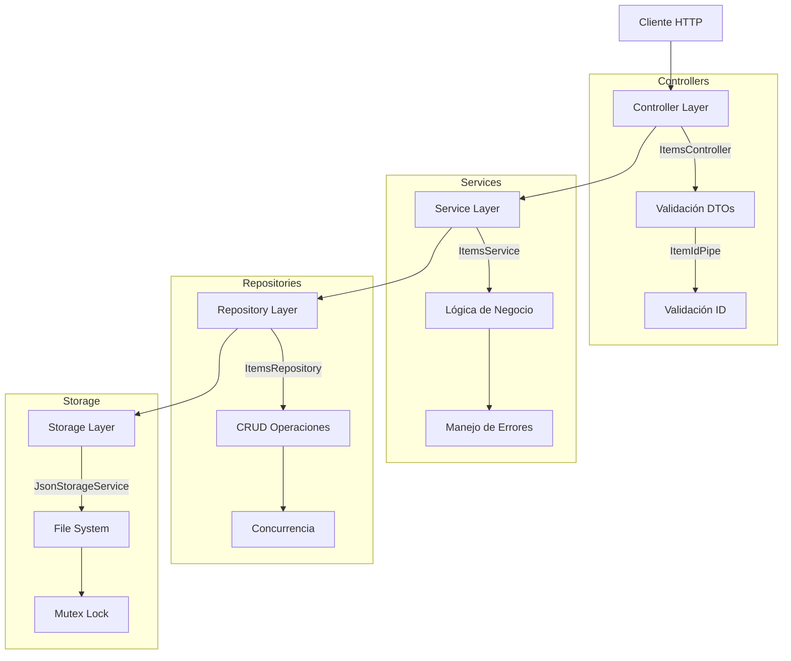

# MercadoLibre Challenge - Backend

<div align="center">


</div>

API REST que proporciona los endpoints necesarios para soportar una página de detalle de producto similar a MercadoLibre. La aplicación está construida siguiendo los principios SOLID, patrones de diseño y buenas prácticas de programación.

## 📋 Tabla de Contenidos

- [Características](#-características)
- [Requisitos Previos](#-requisitos-previos)
- [Instalación](#-instalación)
- [Configuración](#-configuración)
- [Uso](#-uso)
- [API Endpoints](#-api-endpoints)
- [Tests](#-tests)
- [Estructura del Proyecto](#-estructura-del-proyecto)
- [Arquitectura](#-arquitectura)
- [Datos de Ejemplo](#-datos-de-ejemplo)
- [Licencia](#-licencia)

## ✨ Características

- **Arquitectura Robusta**
  - Diseño modular y escalable
  - Principios SOLID
  - Inyección de dependencias
  - Patrones de diseño (Repository, Factory, Strategy)

- **Seguridad y Validación**
  - Validación de datos con class-validator
  - Sanitización de entrada
  - Manejo robusto de errores
  - Logging detallado

- **Documentación y Pruebas**
  - Swagger/OpenAPI
  - Colección Postman
  - Tests unitarios
  - Tests de integración
  - >80% cobertura de código

- **Persistencia y Logging**
  - Almacenamiento JSON local
  - Sistema de logging multinivel
  - Operaciones atómicas
  - Manejo de concurrencia

## 🔧 Requisitos Previos

- Node.js (v14 o superior)
- npm (v6 o superior)
- Git
- Postman (opcional)

## 🚀 Instalación

1. Clonar el repositorio:
```bash
git clone https://github.com/matipaz-dev/meli-challenge.git
cd meli-challenge
```

2. Instalar dependencias:
```bash
npm install
```

La aplicación creará automáticamente los directorios necesarios (logs, data) al iniciar.

## ⚙️ Configuración

Para ejecutar la aplicación necesitarás:
- Un archivo `.env` basado en `.env.example`

### Variables de Entorno

| Variable | Descripción | Valor por Defecto |
|----------|-------------|-------------------|
| PORT | Puerto del servidor | 3000 |
| NODE_ENV | Entorno de ejecución | development |
| LOG_LEVEL | Nivel de logging | debug |
| LOG_FILE | Archivo de logs | logs/app.log |
| DATA_PATH | Ruta de almacenamiento de datos | data/ |

## 🎮 Uso

### Desarrollo

```bash
# Modo desarrollo con hot-reload
npm run start:dev

# Modo debug
npm run start:debug
```

### Producción

```bash
# Construir la aplicación
npm run build

# Ejecutar en producción
npm run start:prod
```

La aplicación automáticamente:
1. Creará los directorios necesarios (logs, data)
2. Inicializará los datos de ejemplo
3. Iniciará el servidor

### Docker

```bash
# Desarrollo (con hot-reload)
docker-compose up -d

# Ver logs
docker-compose logs -f

# Detener servicios
docker-compose down

# Reconstruir la imagen
docker-compose build

# Producción (opcional)
docker build --target production -t meli-challenge:prod .
docker run -p 3000:3000 meli-challenge:prod
```

El entorno Docker está configurado para desarrollo por defecto, incluyendo:
- Hot-reload del código
- Todas las dependencias de desarrollo
- Logs en modo debug
- Montaje del código fuente local

Para producción, usar el target 'production' en el build que:
- Incluye solo dependencias de producción
- Optimiza el tamaño de la imagen
- Usa configuración de producción

## 🔌 API Endpoints

### Items

#### GET /api/items/:id
- **Descripción**: Obtiene un item específico
- **Params**: 
  - `id`: ID del item (ej: MLA1234567)
- **Respuesta**: Detalles del item
- **Códigos**: 200, 404

#### GET /api/items/seller/:sellerId
- **Descripción**: Obtiene items de un vendedor específico
- **Params**: 
  - `sellerId`: ID del vendedor (número positivo)
- **Respuesta**: Lista de items del vendedor
- **Códigos**: 200, 404

#### POST /api/items
- **Descripción**: Crea un nuevo item
- **Body**: Item DTO
- **Respuesta**: Item creado
- **Códigos**: 201, 400

## 🧪 Tests

```bash
# Tests unitarios
npm run test

# Tests unitarios (watch mode)
npm run test:watch

# Tests de integración
npm run test:e2e

# Cobertura de código
npm run test:cov
```

## 📁 Estructura del Proyecto

```
src/
├── config/                 # Configuración
│   ├── configuration.ts    # Variables de entorno
│   └── validation.ts      # Esquemas de validación
├── modules/
│   └── items/            # Módulo de items
│       ├── dto/          # Data Transfer Objects
│       ├── tests/        # Tests unitarios
│       ├── controller.ts # Controlador REST
│       ├── service.ts    # Lógica de negocio
│       └── repository.ts # Acceso a datos
├── shared/               # Recursos compartidos
│   ├── services/        # Servicios comunes
│   └── utils/           # Utilidades
├── scripts/             # Scripts de utilidad
│   └── init-data.ts    # Inicialización de datos
└── main.ts              # Punto de entrada
```

## 📦 Datos de Ejemplo

La aplicación utiliza un archivo `data/items.json` para almacenar los datos. Al iniciar por primera vez, si el archivo no existe, se crearán automáticamente datos de ejemplo que incluyen:

### Productos Disponibles

1. **iPhone 13 Pro Max 256GB**
   - ID: MLA1234567
   - Vendedor: Apple Store Official
   - Precio: USD 999.99

2. **MacBook Pro 14-inch M1 Pro**
   - ID: MLA1234568
   - Vendedor: Apple Store Official
   - Precio: USD 1999.99

3. **Samsung Galaxy S21 Ultra 5G**
   - ID: MLA1234569
   - Vendedor: Samsung Official Store
   - Precio: USD 899.99

4. **iPad Air 4th Generation**
   - ID: MLA1234570
   - Vendedor: Apple Store Official
   - Precio: USD 599.99

5. **Samsung Galaxy Watch 4**
   - ID: MLA1234571
   - Vendedor: Samsung Official Store
   - Precio: USD 249.99

### Características de los Datos

- Productos de Apple Store y Samsung Store
- Precios y especificaciones realistas
- Imágenes de ejemplo
- Ratings de vendedores
- Descripciones detalladas
- Estados de productos
- Información de envío

Los datos se inicializan solo si el archivo no existe, permitiendo mantener los datos una vez creados.

## 📄 Arquitectura

### Visión General



### Decisiones Arquitectónicas Clave

#### 1. Almacenamiento JSON vs Base de Datos
- **Decisión**: Uso de archivos JSON para persistencia
- **Razones**:
  - Simplicidad en la instalación y ejecución
  - No requiere servicios externos
  - Adecuado para el volumen de datos esperado
- **Consideraciones**:
  - Mutex para operaciones concurrentes
  - Escritura atómica usando archivos temporales
  - Validación de integridad de datos

#### 2. Manejo de Concurrencia
```typescript
// Implementación en JsonStorageService
const globalMutex = new Mutex();

async writeJson<T>(filename: string, data: T): Promise<void> {
  return globalMutex.runExclusive(async () => {
    const tempPath = `${filePath}.tmp`;
    await fs.writeFile(tempPath, jsonString, 'utf8');
    await fs.rename(tempPath, filePath);
  });
}
```

#### 3. Validación y DTOs
- **Enfoque por Capas**:
  1. **Pipe Personalizado**: Validación de formato ID
  ```typescript
  // ItemIdPipe
  if (!value.match(/^MLA\d+$/)) {
    throw new BadRequestException('Invalid item ID format');
  }
  ```
  2. **Class Validator**: Reglas de negocio
  ```typescript
  export class CreateItemDto {
    @Length(5, 100)
    title: string;

    @ValidateNested()
    @Type(() => PriceDto)
    price: PriceDto;
  }
  ```
  3. **Service**: Validaciones de negocio complejas

#### 4. Manejo de Errores
- **Estrategia por Niveles**:
  1. **Controlador**: Errores HTTP y validación
  2. **Servicio**: Errores de negocio
  3. **Repositorio**: Errores de persistencia
  4. **Storage**: Errores de sistema de archivos

```typescript
// Ejemplo de manejo de errores en cadena
async findById(id: string): Promise<ItemDto> {
  try {
    const items = await this.getItems();
    const item = items.find(i => i.id === id);
    if (!item) {
      throw new NotFoundException('Item not found');
    }
    return item;
  } catch (error) {
    this.logger.error(`Error finding item ${id}: ${error.message}`);
    throw error;
  }
}
```

### Patrones Implementados

#### 1. Repository Pattern
- **Implementación**: `ItemsRepository`
- **Beneficio**: Abstrae la persistencia permitiendo cambiar el almacenamiento
```typescript
export class ItemsRepository {
  async findAll(): Promise<ItemDto[]>
  async findById(id: string): Promise<ItemDto>
  async save(item: ItemDto): Promise<void>
}
```

#### 2. Service Layer Pattern
- **Implementación**: `ItemsService`
- **Beneficio**: Encapsula lógica de negocio
```typescript
export class ItemsService {
  async createItem(dto: CreateItemDto): Promise<ItemDto>
  async getItemById(id: string): Promise<ItemDto>
}
```

#### 3. DTO Pattern
- **Implementación**: Separación de DTOs por operación
- **Beneficio**: Validación y transformación de datos específica
```typescript
export class CreateItemDto { /* entrada */ }
export class ItemResponseDto { /* salida */ }
```

### Escalabilidad y Evolución

#### 1. Migración a Base de Datos
```typescript
// Implementación actual
export class ItemsRepository {
  private readonly jsonStorage: JsonStorageService;
}

// Futura implementación
export class ItemsRepository {
  private readonly dbConnection: DatabaseConnection;
}
```

#### 2. Nuevos Endpoints
- Estructura modular permite agregar endpoints fácilmente
- Reutilización de validaciones y DTOs
- Logging y manejo de errores consistente

#### 3. Mejoras Planificadas
1. **Caching**:
```typescript
export class ItemsService {
  private readonly cache: Map<string, ItemDto>;
  private readonly TTL = 5 * 60 * 1000; // 5 minutos
}
```

2. **Event Sourcing**:
```typescript
export interface ItemEvent {
  type: 'created' | 'updated' | 'deleted';
  itemId: string;
  timestamp: Date;
  data: any;
}
```

3. **Métricas y Monitoreo**:
```typescript
export class MetricsService {
  recordLatency(operation: string, duration: number): void
  incrementCounter(operation: string): void
}
```

### Limitaciones Actuales

1. **Persistencia**:
   - No soporta consultas complejas
   - Limitado a operaciones CRUD básicas
   - Escalabilidad limitada por sistema de archivos

2. **Concurrencia**:
   - Lock global puede impactar performance
   - No soporta escrituras paralelas
   - Limitado a un solo proceso

3. **Búsqueda**:
   - No hay índices
   - Búsqueda secuencial
   - No soporta full-text search

### Próximos Pasos

1. **Corto Plazo**:
   - Implementar caché en memoria
   - Agregar métricas básicas
   - Mejorar logging

2. **Mediano Plazo**:
   - Migrar a MongoDB/PostgreSQL
   - Implementar búsqueda avanzada
   - Agregar autenticación

3. **Largo Plazo**:
   - Microservicios
   - Event sourcing
   - Escalamiento horizontal

## 📄 Licencia

Este proyecto está bajo la Licencia MIT. Ver el archivo [LICENSE](LICENSE) para más detalles.